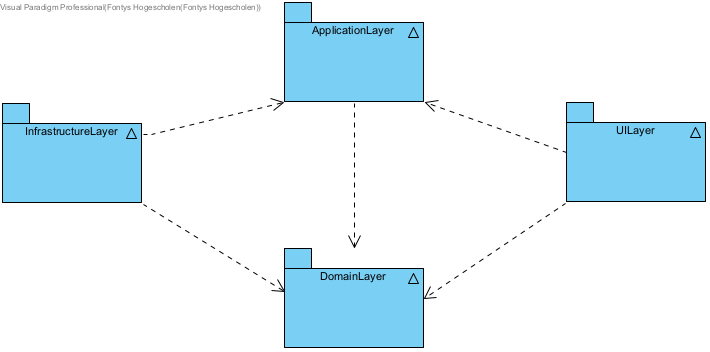

# StayActive
## HBO - ICT: Year 1: Semester 2 project
The goal of the project is to design a modular application using OOP principles (e.g. SOLID), design patterns (e.g. Factory patter, Template pattern)  and testing (e.g. Acceptancy test, Intergration test, Unit test). To do this, we had to first make a functional and technical design of our application. 

## 4 - Tier architecture 
Based on [CleanArchitecture](https://github.com/jasontaylordev/CleanArchitecture). The dependencies 
between the layers are as following:

- ### [Application layer](Application)
The application layer depends only on the domain layer. Furthermore, it contains all the application logic. The application
layer contains the interfaces and logic what are used throughout the whole application. 
- ### [Domain layer](Domain)
The domain layer has no dependency on the other layers. It contains all entities, enums, exceptions, interfaces, 
types and logic specific to the domain layer.
- ### [ConsolUI layer](ConsoleUI)
For the console UI I have used the MVC design pattern. A class diagram was provided by HBO ICT for inspiration.
However, I did give my own implementation to it. The console UI  depends on the infrastructure layer through dependency 
injection.
- ### [Infrastructure layer](Infrastructure)
I have used the provided class diagram for the template pattern provided by HBO ICT to make the database layer modular. To access the database layer
I make use of DAO's and Repositories.

